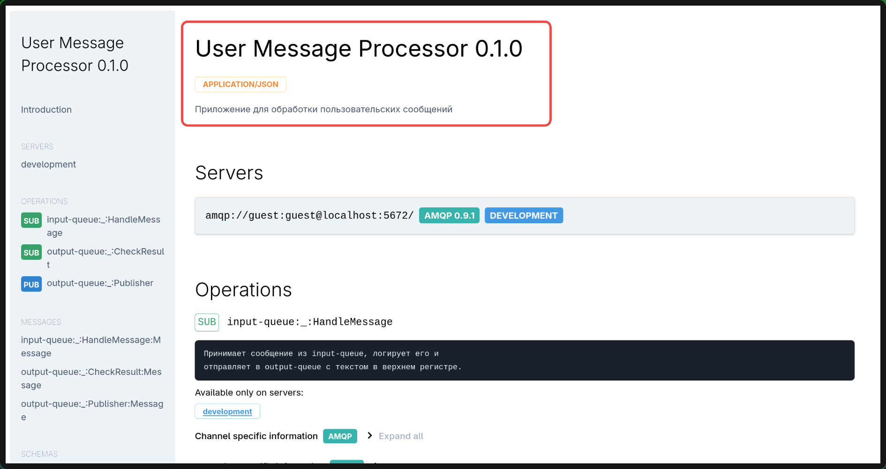

# Генерация документации 📝

Вы создали, протестировали и улучшили своё FastStream-приложение, добавив взаимодействие между сервисами и валидацию данных с Pydantic! 🎉 Теперь пора задокументировать его, чтобы другие разработчики (или вы сами в будущем) могли понять, как оно работает. FastStream автоматически генерирует документацию в формате **[AsyncAPI](https://www.asyncapi.com/)**, которая описывает ваши очереди и формат сообщений. В этом разделе мы научимся создавать и просматривать эту документацию. Готовы сделать ваше приложение понятным для всех? Погнали! 🚀

## Что такое AsyncAPI? 🤔

**[AsyncAPI](https://www.asyncapi.com/)** — это стандарт для документирования асинхронных API, таких как приложения, работающие с брокерами сообщений. Он похож на OpenAPI (для REST API), но создан специально для систем, использующих очереди и события. AsyncAPI-документация показывает:

- Какие **очереди** использует ваше приложение 📬.
- Как выглядят **сообщения** (например, структура JSON, заданная Pydantic) 📋.
- Как другие системы могут **подключиться** к вашему приложению 🔗.

FastStream делает генерацию AsyncAPI-документации невероятно простой — буквально пара команд! 😎

## Шаг 1: Генерация документации 📄

FastStream предоставляет CLI-команды для создания документации. Мы будем работать с приложением из предыдущих разделов (`app.py`), которое использует очереди `input-queue` и `output-queue` и модель Pydantic `UserMessage`.

Убедитесь, что вы находитесь в папке `faststream-tutorial` и ваше виртуальное окружение активно. Выполните команду:

```bash
faststream docs gen app:app
```

**Что происходит?** 🔍

- `app:app` указывает на модуль `app.py` и объект `app` (экземпляр `FastStream`).
- Команда анализирует ваше приложение, включая подписчиков (`@broker.subscriber`) и модели Pydantic.
- Результат сохраняется в файл `asyncapi.json` в текущей директории.

Откройте `asyncapi.json` в текстовом редакторе. Вы увидите JSON-структуру, описывающую:

- Очереди `input-queue` и `output-queue`.
- Формат сообщений (`UserMessage` с полями `username` и `message`).

## Шаг 2: Просмотр документации 🌐

JSON-файл полезен, но читать его неудобно. FastStream позволяет запустить веб-интерфейс для просмотра документации в красивом формате HTML. Выполните:

```bash
faststream docs serve app:app
```

**Что происходит?** 🔄

- FastStream генерирует AsyncAPI-документацию и запускает локальный веб-сервер.
- Сервер не использует `broker.start()` или `broker.connect()`, так как он только анализирует код приложения, а не подключается к RabbitMQ.

Откройте браузер и перейдите по адресу `http://localhost:8000`. Вы увидите интерактивную HTML-страницу, где:

- Показаны очереди `input-queue` и `output-queue` 🗄️.
- Описана структура сообщений (`UserMessage` с полями `username` и `message`) 📋.

Попробуйте кликнуть по очередям и сообщениям — это помогает понять, как ваше приложение взаимодействует с брокером! 😊

## Шаг 3: Улучшение документации ✍️

Чтобы документация была информативнее, добавим метаданные в приложение: заголовок, описание и докстринги для подписчиков. Откройте `app.py` и обновите код:

```python
--8<-- "src/tutorial/documentation/app.py"
```

**Что изменилось?** 🔍

- **Pydantic `Field`**: Добавлены `description` и `examples` для полей `username` и `message`, которые отображаются в AsyncAPI-документации.
- **Параметры `title` и `description`**: Указаны в `FastStream` для метаданных приложения.
- **Докстринги**: Добавлены к функциям `handle_message` и `check_result`. FastStream парсит докстринги подписчиков (`@broker.subscriber`) и включает их в документацию, описывая назначение каждого обработчика.

Сгенерируйте и просмотрите документацию снова:

```bash
faststream docs gen app:app
faststream docs serve app:app
```

[](../assets/img/AsyncAPI.png)

В `http://localhost:8000` вы увидите:

- Заголовок "User Message Processor" и описание приложения в верхней части страницы.
- Очереди `input-queue` и `output-queue` с описаниями из докстрингов.
- Поля `UserMessage` с описаниями и примерами из `Field`. 🎉

## Шаг 4: Практическое задание 📚

Закрепите знания с помощью заданий:

1. Добавьте в модель `UserMessage` поле `timestamp: datetime` с `Field`, включая `description` (например, "Время отправки сообщения") и `examples` (например, `"2023-10-01T12:00:00"`). Сгенерируйте документацию и проверьте, как оно отображается.
2. Измените докстринг для `check_result`, добавив больше деталей (например, "Логирует результат обработки сообщения из output-queue для дальнейшего анализа"). Убедитесь, что это отражено в документации.
3. (Дополнительно) Добавьте параметр `version="1.0.0"` в `FastStream` и проверьте, как он отображается в веб-интерфейсе.

## Что дальше? 🗺️

Вы научились генерировать и просматривать AsyncAPI-документацию для вашего FastStream-приложения! 🎉 Это отличный способ делиться спецификацией с командой или документировать проект. В следующем разделе мы подведем итоги и расскажем, как продолжить изучение FastStream. Перейдите к [**Что дальше?**](./next_steps.md), чтобы узнать о других брокерах, интеграциях и ресурсах.

Если у вас есть идеи, вопросы или нужна помощь, загляните в [официальную документацию FastStream](https://faststream.airt.ai/latest/), пишите в [Telegram](https://t.me/python_faststream) или [Discord](https://discord.gg/qFm6aSqq59). Продолжайте документировать и кодить! 🚀
